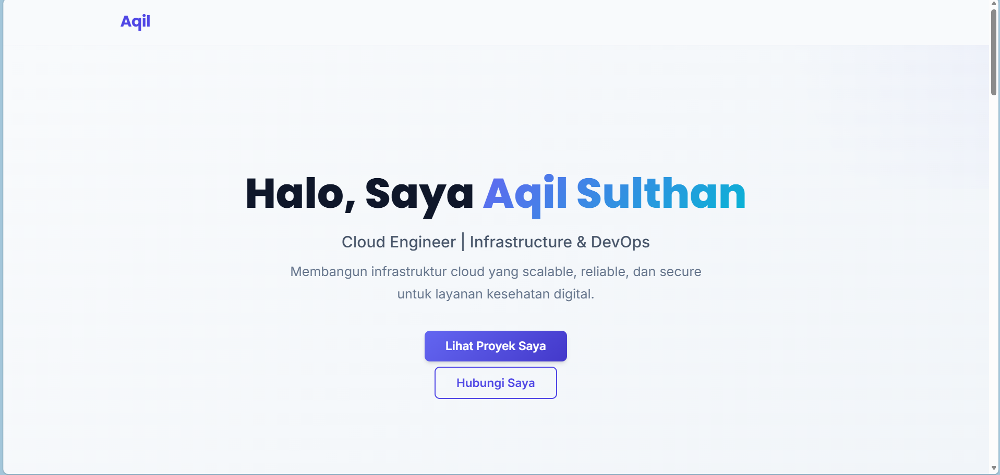
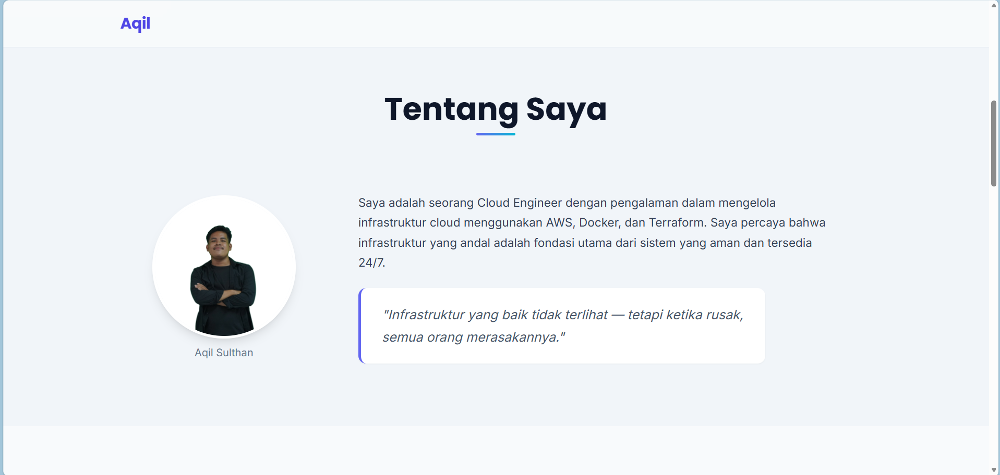
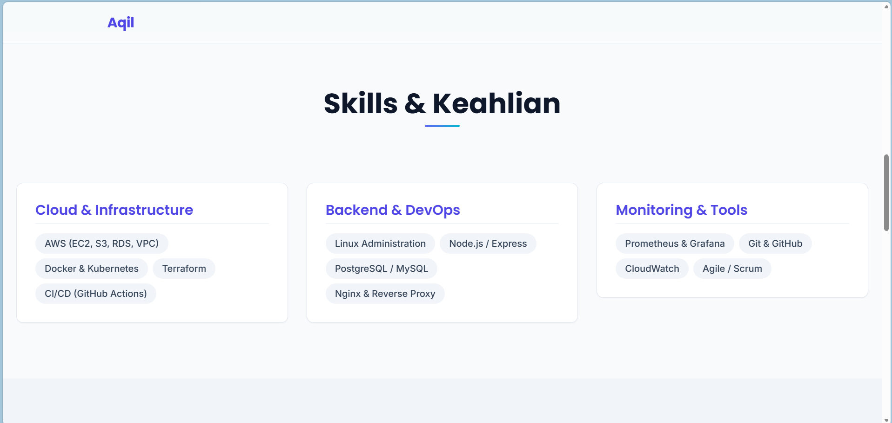
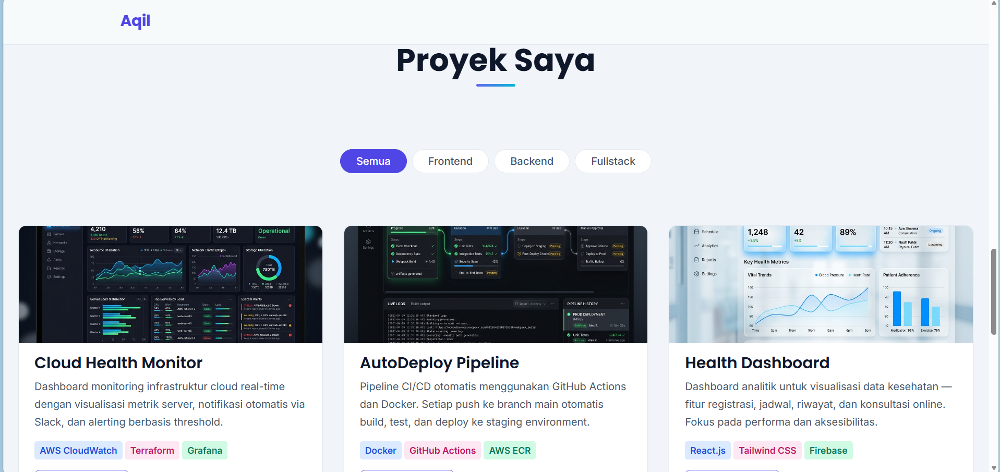
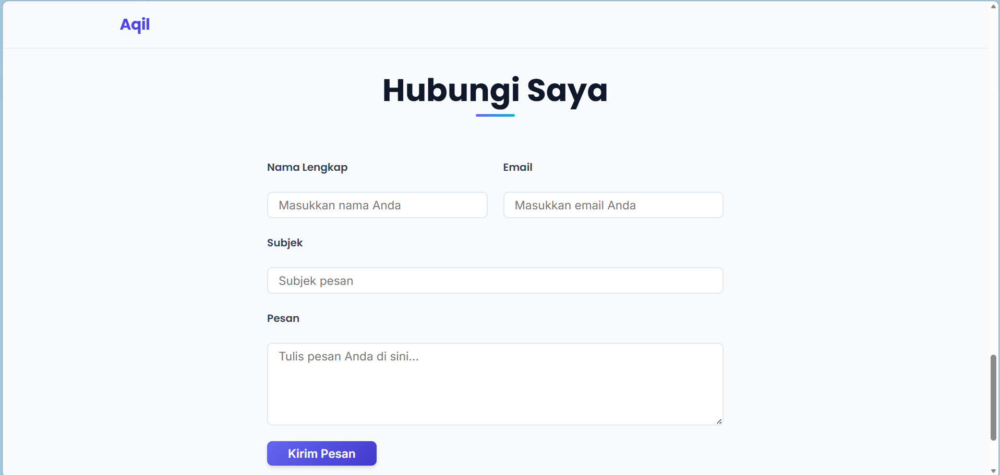
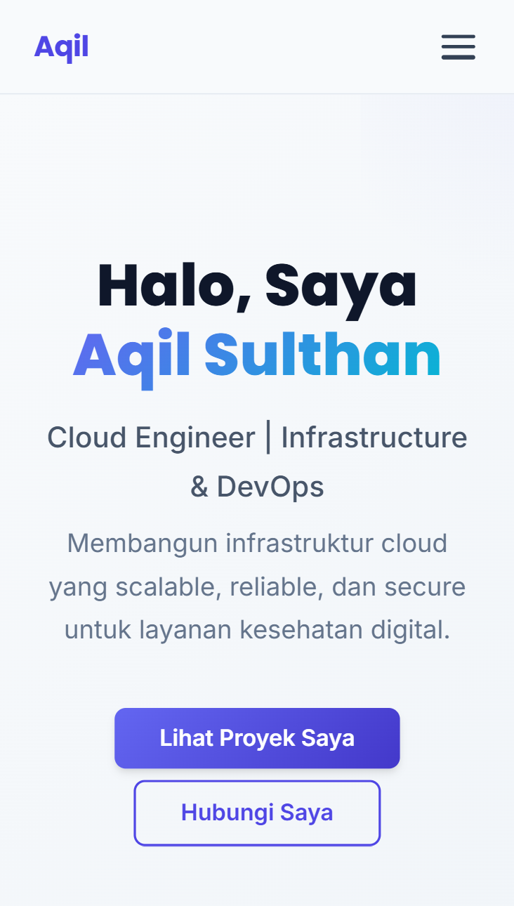
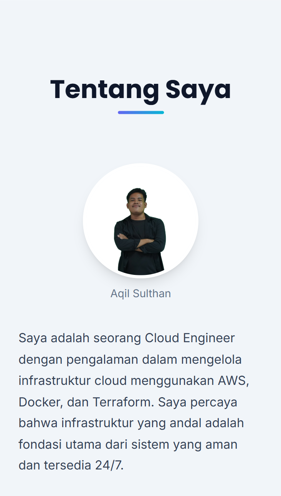
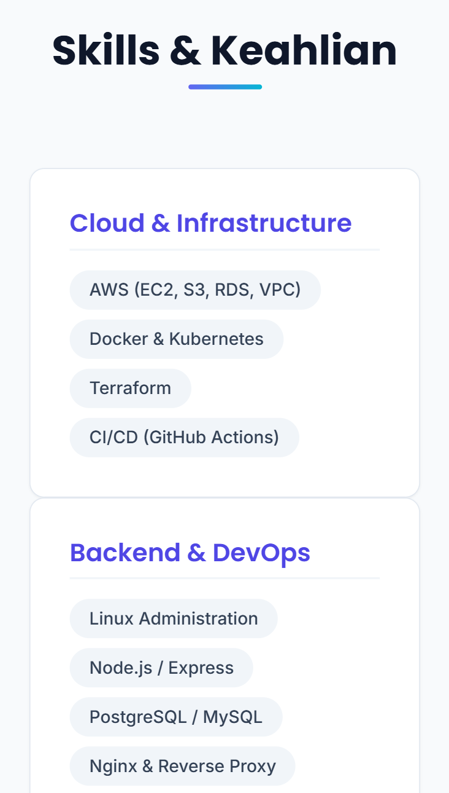
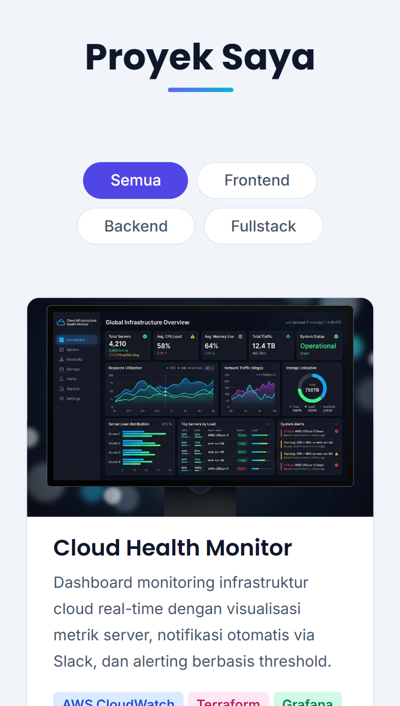
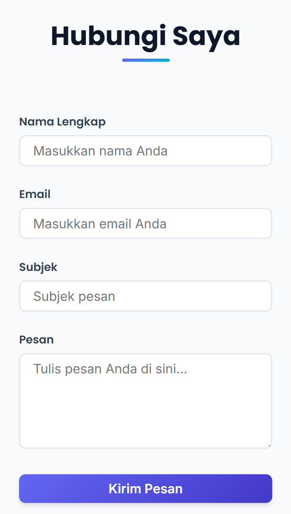

# 04: Final Results — Aqil Sulthan

## Portfolio Info
- **Nama:** Aqil Sulthan
- **Repository:** [github.com/aqilsulthan/aqilsulthan.github.io]
- **Live URL:** [aqilsulthan.github.io]
- **Date:** [isi tanggal deploy]

---

## Screenshot: Desktop











---

## Screenshot: Mobile











---

## What I Learned

1. **RTCC-O framework** membuat prompting jauh lebih terstruktur. Dengan mendefinisikan Role, Task, Context, Constraints, dan Output secara eksplisit di setiap prompt, output AI jauh lebih sesuai dan jarang perlu revisi besar. Ini menghemat waktu dibanding chatting tanpa struktur.

2. **CSS-only interactions** (hamburger checkbox, radio filter, :valid/:invalid validasi) membuktikan bahwa JavaScript tidak selalu diperlukan untuk website modern. Teknik ini juga menunjukkan pemahaman mendalam tentang CSS pseudo-class dan sibling selectors.

3. **Zero `<div>` semantic layout** memaksa penggunaan element HTML5 yang tepat (`<header>`, `<nav>`, `<main>`, `<section>`, `<article>`, `<figure>`, `<blockquote>`, `<footer>`). Tantangan terbesarnya adalah layout desktop (about section) tanpa `<div>` wrapper — solusinya menggunakan CSS Grid dengan `grid-column` dan `auto` track sizing.

---

## Challenges & Solutions

**Challenge 1:** Layout tentang section desktop tanpa `<div>` wrapper — float approach rawan broken layout saat text pendek.

**How I Solved:** Gunakan CSS Grid pada `<section>` langsung dengan `grid-template-columns: auto 1fr`. Section title span full-width (`grid-column: 1 / -1`), figure dan paragraf di baris yang sama di kolom berbeda. Blockquote di baris berikutnya full-width. Ini lebih robust dibanding float + shape-outside.

---

**Challenge 2:** CSS-only project filter menggunakan radio button hack — radio inputs harus menjadi siblings dari proyek section untuk CSS `~` selector bekerja, tapi radio inputs tidak boleh terlihat.

**How I Solved:** Tempatkan radio inputs di `<main>` sebagai siblings dari `<section id="proyek">`. Sembunyikan dengan `position: absolute; opacity: 0; width: 1px` (bukan `display: none`) agar tetap accessible. Gunakan `:checked ~ #proyek article` untuk mengontrol visibility.

---

## Checklist

```
[x] Desktop screenshot ada? → ✅ (5 screenshot, ss-web-1 sampai ss-web-5)
[x] Mobile screenshot ada? → ✅ (5 screenshot, ss-mobile-1 sampai ss-mobile-5)
[x] No horizontal scroll? → ✅
[x] All sections visible? → ✅ (hero, tentang, skills, proyek, kontak, footer)
[x] 3+ insights documented? → ✅
[x] Challenges solved documented? → ✅
[x] GitHub Pages URL available? → Belum deploy
```
